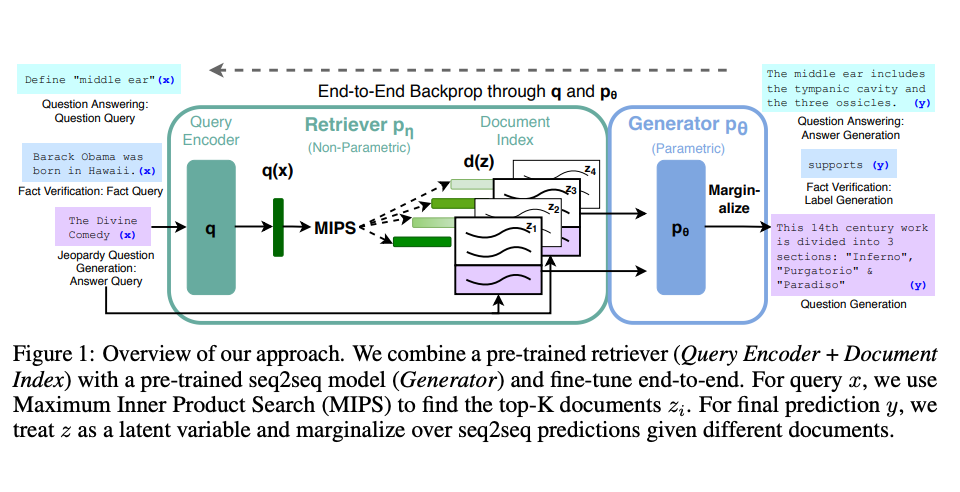

<!-- [](https://github.com/CTU-LinguTechies/VN-Law-Advisor/blob/master/LICENSE) -->
[](https://github.com/AVG-Team/VN-Law/issues)
[](https://github.com/AVG-Team/VN-Law/pulls)
[](https://github.com/AVG-Team/VN-Law/graphs/commit-activity)
[](https://github.com/AVG-Team/VN-Law/graphs/contributors)


# VN-LAW [](http://vnlaw.japaneast.cloudapp.azure.com) [](https://vn-law-docs.netlify.app)

<a href="https://github.com/CTU-LinguTechies/VN-Law-Advisor/issues/new?assignees=&labels=&projects=&template=bug_report.md&title=%F0%9F%90%9B+Bug+Report%3A+">Bug Report ⚠️
</a>

<a href="https://github.com/CTU-LinguTechies/VN-Law-Advisor/issues/new?assignees=&labels=&projects=&template=feature_request.md&title=RequestFeature:">Request Feature 👩‍💻</a>

Ứng dụng hỗ trợ tra cứu, hỏi đáp tri thức pháp luật dựa trên Bộ pháp điển và CSDL văn bản QPPL Việt Nam.

Mục tiêu là phát triển một hệ thống tra cứu, hỏi đáp tri thức pháp luật Việt Nam. Dựa trên các mô hình ngôn ngữ lớn cùng với kiến trúc microservices.

Dự án được thực hiện trong cuộc thi [Phần Mềm Nguồn Mở-Olympic Tin học Sinh viên Việt Nam 2023](https://www.olp.vn/procon-pmmn/ph%E1%BA%A7n-m%E1%BB%81m-ngu%E1%BB%93n-m%E1%BB%9F). Được được open source theo giấy phép [GNU General Public License v3.0](https://www.gnu.org/licenses/gpl-3.0.en.html) bởi đội tác giả CTU-LinguTechnies.

Để biết thêm chi tiết về cuộc thi, bạn có thể xem tại [đây](https://vfossa.vn/tin-tuc/de-thi-phan-mem-nguon-mo-olp-2023-688.html).

Link thuyết trình Canva tại cuộc thi [link](https://www.canva.com/design/DAF2LR6LJIs/NFyCiN8JIVlDoRa33GSp1Q/edit?utm_content=DAF2LR6LJIs&utm_campaign=designshare&utm_medium=link2&utm_source=sharebutton)

Slide bài thuyết trình tại cuộc thi dưới dạng PDF có thể được truy cập tại đây: [Slide](./docs/pdf/Phần%20mềm%20nguồn%20mở%202023.pdf)

## 🔎 Danh Mục

1. [Giới Thiệu](#Giới-Thiệu)
2. [Chức Năng](#chức-năng-chính)
3. [Tổng Quan Hệ Thống](#👩‍💻-tổng-quan-hệ-thống)
4. [Cấu Trúc Thư Mục](#cấu-trúc-thư-mục)
5. [Hướng Dẫn Cài Đặt](#hướng-dẫn-cài-đặt)
    - [📋 Yêu Cầu - Prerequisites](#yêu-cầu-📋)
    - [🔨 Cài Đặt](#🔨-cài-đặt)
6. [CI/CD](#ci/cd)
7. [🙌 Đóng Góp](#🙌-đóng-góp-cho-dự-án)
8. [📝 License](#📝-license)

## Giới Thiệu

-   [Pháp điển](https://vi.wikipedia.org/wiki/Ph%C3%A1p_%C4%91i%E1%BB%83n) là tập hợp các quy phạm pháp luật đang còn hiệu lực của các văn bản quy phạm pháp luật do cơ quan nhà nước ở trung ương ban hành, từ Thông tư trở lên và trừ Hiến pháp.
-   [Cơ sở dữ liệu văn bản quy phạm pháp luật Việt Nam](https://quochoi.vn/csdlth/vanbanphapluat/Pages/Home.aspx) được xây dựng từ năm 2000, bao gồm các văn bản quy phạm pháp luật từ năm 1990 đến nay. Cơ sở dữ liệu này được cập nhật thường xuyên, đảm bảo tính toàn vẹn, đầy đủ và chính xác của các văn bản quy phạm pháp luật.
-   Tuy nhiên, do việc cập nhật không thường xuyên của pháp điển so với các văn bản quy phạm pháp luật, nên pháp điển hiện tại không đảm bảo tính toàn vẹn, đầy đủ và chính xác của các văn bản quy phạm pháp luật.

## Chức Năng Chính

Project tập trung vào các chức năng chính như sau:

-   🤖 Trả lời các câu hỏi về pháp luật của người dùng.
-   🔍 Hệ thống tra cứu các pháp điển, văn bản quy phạm pháp luật: chỉ mục, liên kết các điều mục, các bảng và biểu mẫu.
-   📖 Tóm tắt văn bản, hỗ trợ người dùng trong lúc tra cứu.
-   📝 Gợi ý văn bản quy phạm pháp luật theo từ khóa tìm kiếm, nhận đóng góp để cải thiện gợi ý.

## 👩‍💻 Tổng Quan Hệ Thống

Backend của hệ thống được thiết kế theo kiến trúc microservices, với các công nghệ sử dụng như sau:

-   [ReactJS](https://react.dev/): Xây dựng web-app, hỗ trợ SEO, SSR, SSG.
-   [Kong API Gateway](https://konghq.com/kong/): API Gateway cho hệ thống.
-   [SpringBoot](https://spring.io/projects/spring-boot): Dựng API cho Law Service, Authentication Service
-   [Flask](https://flask.palletsprojects.com/en/2.0.x/): Dựng API cho Q&A - RAG Service.
-   [LangChain](https://www.langchain.com/): Sử dụng để truy vấn các context là tri thức luật.
-   [MySQL](https://www.mysql.com/): Cơ sở dữ liệu quan hệ.
-   [Redis](https://redis.io/): Cơ sở dữ liệu NoSQL in-memory dạng key-value.
-   [ChromaDB](https://www.trychroma.com/): Cơ sở dữ liệu embedding dạng vector.
-   [RabbitMQ](https://www.rabbitmq.com/): Message broker cho hệ thống.
-   [Docker](https://www.docker.com/): Containerize các service.
-   [Docker Compose](https://docs.docker.com/compose/): Quản lý các container.
-   [Prometheus](https://prometheus.io/): Monitor các metrics.
-   [Grafana](https://grafana.com/): WebUI hiển thị metrics.
-   [Transformer.js](https://github.com/xenova/transformers.js/): Thư viện transformer cho JS, load trực tiếp trên trình duyệt web.


### RAG

Hệ thống Tăng Cường Trí Tuệ (RAG) đại diện cho một mô hình đổi mới tiên tiến tận dụng sức mạnh kết hợp của [ChatGPT Api](https://openai.com/api/), [LangChain](https://www.langchain.com/) và [Weaviate](https://weaviate.io/). Sự tích hợp tinh vi này cho phép sự kết hợp hài hòa giữa việc truy xuất thông tin và tạo nội dung, tạo ra các kết quả không chỉ chính xác và mạch lạc mà còn đầy sáng tạo và sâu sắc.




Thiết kế Hệ thống hỏi đáp như hình vẽ bên dưới:


### CI/CD

Project CI/CD sử dụng Github và [Github Actions](https://docs.github.com/en/actions) để tự động hóa quá trình build và deploy. Quy trình như hình vẽ sau:


<!-- 
Các workflows của project được lưu tại: [.github/workflows](.github/workflows), với các workflow như sau:

-   [build-docker.yaml](.github/workflows/build-docker.yaml): Build docker image cho các service và push lên docker hub
-   [build-docker-github.yaml](.github/workflows/build-docker-github.yaml): Build docker image cho các service và push lên github packages
-   [build-documentation.yaml](.github/workflows/build-documentation.yaml): Build documentation và push lên github pages
-   [commitlint.yaml](.github/workflows/deploy-docker-compose.yaml): Lint các commit message của các nhánh
-   [test-auth-service.yaml](.github/workflows/test-auth-service.yaml): Build và test kiểm thử auth service
-   [test-law-service.yaml](.github/workflows/test-law-service.yaml): Build và test kiểm thử law service -->

## Cấu trúc thư mục
-   [API Gateway](./api-gateway) - Crawl vào CSDL từ nguồn pháp điển Việt Nam.

-   [Authorization Service](./auth-service) - Dịch vụ xác thực.

-   [Chat Service](./chat-service) - Dịch vụ cung cấp thông tin Pháp Luật.

-   [Law Service](./law-service) - Dịch vụ quản lý dữ liệu pháp điển và văn bản quy phạm pháp luật.

-   [Crawl](./crawl) - Crawl vào CSDL từ nguồn pháp điển Việt Nam.

-   [Web](./front-end/website) - Giao diện người dùng.
<!-- -   [Documents](./docs/) - Tài liệu về dự án. -->

## Hướng Dẫn Cài Đặt

<!-- Tất cả các images build từ services backend bạn có thể tìm thấy tại [Docker Hub](https://hub.docker.com/repositories/tghuy2002?search=vnlaw). -->

### Yêu Cầu 📋

Để cài đặt và chạy được dự án, trước tiên bạn cần phải cài đặt các công cụ bên dưới. Hãy thực hiện theo các hướng dẫn cài đặt sau, lưu ý chọn hệ điều hành phù hợp với máy tính của bạn:

-   [Docker-Installation](https://docs.docker.com/get-docker/)
-   [Docker-Compose-Installation](https://docs.docker.com/compose/install/)
-   [NodeJS-Installation](https://nodejs.org/en/download/)

### 🔨 Cài Đặt

Trước hết, hãy clone dự án về máy tính của bạn:

```bash
git clone https://github.com/AVG-Team/VN-Law.git
```

#### Chạy crawl lấy dữ liệu pháp điển và các văn bản quy phạm pháp luật (optional):

Bước này chỉ cần chạy một lần duy nhất để lấy dữ liệu pháp điển và các văn bản quy phạm pháp luật vào cơ sở dữ liệu MySQL. Nếu bạn đã có dữ liệu, bạn có thể bỏ qua bước này và tự import vào hệ thống với hướng dẫn phía dưới.

Để cào dữ liệu, hãy:

```bash
cd crawl
```

Và tiếp tục theo hướng dẫn trong thư mục crawl [README.md](./crawl/README.md).

<!-- ### Chạy backend hệ thống

-   Đầu tiên, cd vào thư mục backend:

```bash
cd backend
```

-   Start các services với 1 lệnh docker-compose:

```bash
docker-compose up -d
``` -->

#### PORT BINDING

-   Sau khi chạy xong, các service sẽ được chạy trên các port như sau:
<table width="100%">
<thead>
<th>
Service
</th>
<th>
PORT
</th>
</thead>
<tbody>
<tr>
<td>API Gateway</td>
<td>9000</td>
</tr>
<tr>
<td>Auth Service</td>
<td>9001</td>
</tr>
<tr>
<td>Law Service</td>
<td>9002</td>
</tr>
<tr>
<td>Chat Service</td>
<td>9003</td>
</tr>
<tr>
<td>Recommendation Service</td>
<td>9004</td>
</tr>
</tbody>
</table>

### Chạy web-app

-   Đầu tiên, cd vào thư mục web:

```bash
cd front-end/website
```

-   Cài đặt các thư viện cần thiết:

```bash
npm -i
```

-   Chạy web-app development mode:

```bash
npm start
```

Lúc này web-app sẽ chạy ở địa chỉ [http://localhost:3000](http://localhost:3000). 
<!-- Đến đây, bạn đã cài đặt xong. Còn nếu như bạn muốn chạy project ở môi trường production, hãy ngừng development server và chạy các lệnh sau:

-   Build frontend web-app

```bash
npm run start
```

-   Chạy web-app production mode:

```bash
npm run start
```

Lúc này web-app sẽ chạy ở địa chỉ [http://localhost:3000](http://localhost:3000). -->

## 🙌 Đóng góp cho dự án

<a href="https://github.com/CTU-LinguTechies/VN-Law-Advisor/issues/new?assignees=&labels=&projects=&template=bug_report.md&title=%F0%9F%90%9B+Bug+Report%3A+">Bug Report ⚠️
</a>

<a href="https://github.com/CTU-LinguTechies/VN-Law-Advisor/issues/new?assignees=&labels=&projects=&template=feature_request.md&title=RequestFeature:">Request Feature 👩‍💻</a>

Nếu bạn muốn đóng góp cho dự án, hãy đọc [CONTRIBUTING.md](.github/CONTRIBUTING.md) để biết thêm chi tiết.

Mọi đóng góp của các bạn đều được trân trọng, đừng ngần ngại gửi pull request cho dự án.

## Liên hệ

-   Nguyễn Mai Bảo Huy: 
-   Nguyễn Tấn Dũng: Ntdvlog1683@gmail.com
-   Nguyễn Văn Hoàng: vanhoang1232134@gmail.com

## 📝 License

This project is licensed under the terms of the [GPL V3](LICENSE) license.
